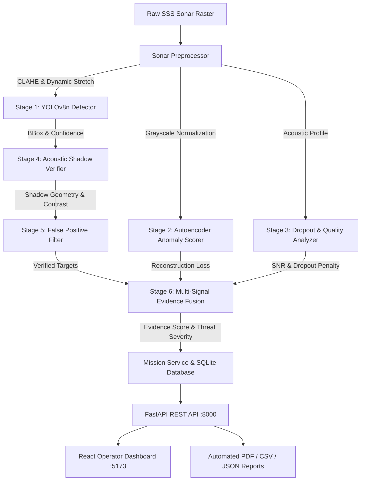

# SIH26057: Marine Anomaly Intelligence Platform

[](https://www.python.org/downloads/)
[](https://fastapi.tiangolo.com/)
[](https://reactjs.org/)
[](https://vitejs.dev/)
[](https://docs.ultralytics.com/)
[](LICENSE)

An enterprise-grade autonomous side-scan sonar (SSS) interpretation and underwater marine debris/anomaly intelligence system engineered for naval survey vessels, autonomous underwater vehicles (AUVs), and coastal defense operations.

---

## Key System Highlights

- **Multi-Modal AI Pipeline**: Integrates YOLOv8n object detection (5 marine classes), Conv2D Autoencoder anomaly scoring, acoustic shadow geometric verification, and signal dropout detection.
- **Physics-Informed Evidence Fusion**: Deterministic weighting framework fusing detector confidence, shadow-contrast ratios, reconstruction error, and signal-to-noise ratio into an operator evidence score ($0.0 - 1.0$) and threat severity index.
- **Offline & Low-SWaP Capable**: Fully autonomous, zero-cloud dependency with mean inference latency $\sim 54\,\text{ms}$ on CPU and single-digit milliseconds on GPU.
- **Operator Command Dashboard**: Modern responsive UI with canvas detection overlays, interactive mission maps, live telemetry review, and automated ReportLab PDF, CSV, and JSON report exports.

---

## System Architecture



---

## Marine Target Taxonomy

The production detector recognizes 5 high-priority underwater target classes:

| Class ID | Target Class | Physical Category | Operational Risk |
|---|---|---|---|
| `0` | **`crab_pot`** | Small Debris / Fishing Gear | Low–Medium navigation hazard |
| `1` | **`submarine_pipeline`** | Critical Infrastructure | High surveillance & integrity priority |
| `2` | **`shipwreck`** | Submerged Wreckage / Structure | High navigational & archaeological interest |
| `3` | **`ghost_net`** | Entanglement Hazard / Biomass Threat | Medium–High ecological risk |
| `4` | **`mine_cylinder`** | Unexploded Ordnance / Munition | Critical immediate defense alert |

---

## Quickstart

### Prerequisites
- Python 3.10+ (tested on Python 3.11/3.14)
- Node.js 18+ and npm

### 1. Backend Setup
```bash
# Install Python dependencies
pip install -r requirements.txt

# Run test suite to verify installation
python -m pytest tests/

# Start FastAPI backend service
python -m uvicorn backend.app.api:app --host 127.0.0.1 --port 8000 --reload
```

### 2. Frontend Setup
```bash
cd frontend
npm install
npm run dev
```
Open your browser at `http://127.0.0.1:5173`.

---

## Directory Structure

```
SIH26057-Marine-Anomaly-Intelligence/
├── ai/                      # Core AI detectors, autoencoders, shadow & fusion logic
├── backend/                 # FastAPI REST application & pipeline bridges
├── frontend/                # Vite + React + TypeScript operator dashboard
├── models/                  # Production neural network weights and metadata
├── configs/                 # YAML configuration definitions
├── database/                # SQLite ORM models and migrations
├── services/                # Mission management and pipeline orchestration
├── utils/                   # Geolocation, PDF generation, tracking helpers
├── scripts/                 # Latency benchmarking, training & PDF generation tools
├── tests/                   # 100+ Unit and integration tests
├── data/                    # Dataset documentation and synthetic demo generators
└── docs/                    # Complete technical, architectural, and API documentation
```

---

## Documentation

- [Architecture & Pipeline Specifications](docs/architecture/ARCHITECTURE.md)
- [Canonical Source of Truth](docs/architecture/SOURCE_OF_TRUTH.md)
- [Mathematical Methodology](docs/methodology/METHODOLOGY.md)
- [Model Evaluation & Benchmarks](docs/evaluation/EVALUATION.md)
- [Offline Field Deployment Guide](docs/setup/OFFLINE.md)
- [REST API Reference](docs/API.md)

---

## License

This project is licensed under the MIT License - see the [LICENSE](LICENSE) file for details.
